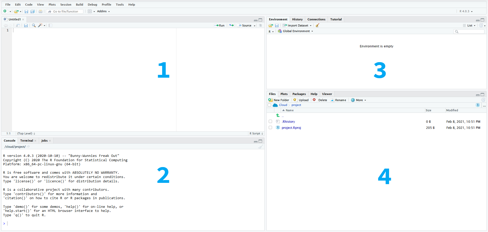
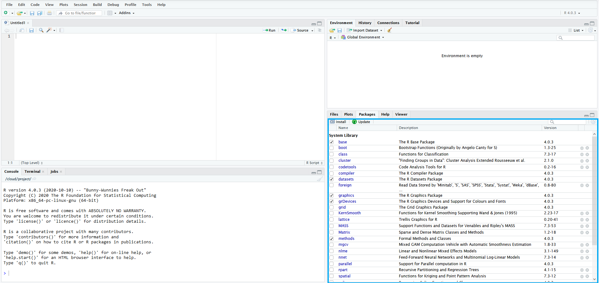

# Függelék

## Az R és az RStudio használata

Az R egy programozási nyelv, amely alkalmas statisztikai számítások elvégzésére és ezek eredményeinek grafikus megjelenítésére. Az R ingyenes, nyílt forráskódú szoftver, mely telepíthető mind Windows, mind Linux, mind MacOS operációs rendszerek alatt, az alábbi oldalról: <https://cran.r-project.org/> Az RStudio az R integrált fejlesztői környezete (*integrated development environment, IDE*), mely egy olyan felhasználóbarát felületet biztosít, ami egyszerűbb és átláthatóbb munkát tesz lehetővé. Az RStudio az alábbi oldalról tölthető le: <https://rstudio.com/products/rstudio/download/>

A „point and click" szoftverekkel szemben az R használata során kódot kell írni, ami bizonyos programozási jártasságot feltételez, de a későbbiekben lehetővé teszi azt adott kutatási kérdéshez maximálisan illeszkedő kódok összeállítását, melyek segítségével az elemzések mások számára is megbízhatóan reprodukálhatóak lesznek. Ugyancsak az R használata mellett szól, hogy komoly fejlesztői és felhasználói közösséggel rendelkezik, így a használat során felmerülő problémákra általában gyorsan megoldást találhatunk.

### Az RStudio kezdőfelülete

Az RStudio kezdőfelülete négy panelből, eszközsorból és menüsorból áll:

```{r, fig.align='center', fig.cap='RStudio felhasználói felület', echo=FALSE}

```


Az ***(1) editor*** ablak  szolgál a kód beírására, futtatására és mentésére. A ***(2) console*** ablakban jelenik meg a lefuttatott kód és az eredmények. A jobb felső ablak ***(3) environment*** fülén láthatóak a memóriában tárolt adatállományok, változók és felhasználói függvények. A ***history*** fül mutatja a korábban lefuttatott utasításokat. A jobb alsó ablak ***(4) files*** fülén az aktuális munkakönyvtárban levő mappákat és fájlok találjuk, míg a ***plot*** fülön az elemzéseink során elkészített ábrák jelennek meg. A ***packages*** fülön frissíthetjük a meglévő r csomagokat és telepíthetünk újakat. A ***help*** fülön a különböző függvények, parancsok leírását, és használatát találjuk meg. A `Tools -> Global Options` menüpont végezhetjük el az RStudio testreszabását. Így például beállíthatjuk az ablaktér elrendezését (*Pane layout*), vagy a színvilágot (*Appearance*), illetve azt hogy a kódok ne fussanak ki az ablakból (`Code -> Editing -> Soft wrap R source files`)


### Projekt alapú munka

Bár nem kötelező, de javasolt, hogy az RStudio-ban projekt alapon dolgozzunk, mivel így az összes – az adott projekttel kapcsolatos fájlt – egy mappában tárolhatjuk. Új projekt beállítását a `File->New Project` menüben tehetjük meg, ahol a saját gépünk egy könyvtárát kell kiválasztani, ahová az R scripteket, az adat- és előzményfájlokat menti. Ezenkívül a `Tools->Global Options->General` menüpont alatt le kell tiltani a *„Restore most recently opened project at startup”* és a *„Restore .RData ino workspace at startup”* beállítást, valamint *„Save workspace to .RData on exit”* értékre be kell állítani a *„Never”*  értéket. 


```{r fig.align='center', fig.cap='RStudio projekt beállítások', echo=FALSE}
knitr::include_graphics('figures/13-02_project_options.png')
```

A szükséges beállítások után a `File -> New Project` menüben hozhatjuk létre a projektet. Itt arra is lehetőségünk van, hogy kiválasszuk, hogy a projektünket egy teljesen új könyvtárba, vagy egy meglévőbe kívánjuk menteni, esetleg egy meglévő projekt új verzióját szeretnénk létrehozni. Ha sikeresen létrehoztuk a projektet, az RStudio jobb felső sarkában látnunk kell annak nevét. 


### Scriptek szerkesztése, függvények használata

Új script a `File -> New -> File -> R` Script menüpontban hozható létre, mentésére a File->Save menüpontban egy korábbi script megnyitására `File -> Open` menüpontban van lehetőségünk. Script bármilyen szövegszerkesztővel írható és beilleszthető az editor ablakba. A scripteket érdemes magyarázatokkal (kommentekkel) ellátni, hogy a későbbiekben pontosan követhető legyen, hogy melyik parancs segítségével pontosan milyen lépéseket hajtottunk végre. A magyarázatokat vagy más néven kommenteket kettőskereszt (`#`) karakterrel vezetjük be. 
A scriptbeli utasítások az azokat tartalmazó sorokra állva vagy több sort kijelölve a Run feliratra kattintva vagy a `Ctrl+Enter` billentyűparanccsal futtathatók le. A lefuttatott parancsok és azok eredményei ezután a bal alsó sarokban lévő console ablakban jelennek meg és ugyanitt kapunk hibaüzenetet is, ha valamilyen hibát vétettünk a scriptben.

A munkafolyamat során létrehozott állományok (ábrák, fájlok) ebbe az ún. munkakönyvtárba (*working directory*) mentődnek. Az aktuális munkakönyvtár neve, elérési útja a `getwd()` utasítással jeleníthető meg. A könyvtárban található állományok listázására a `list.files()` utasítással van lehetőségünk. Ha a korábbiaktól eltérő munkakönyvtárat akarunk megadni, azt a `setwd()` függvénnyel tehetjük meg, ahol a ()-ben az adott mappa elérési útját kell megadnunk. Az elérési útban a meghajtó azonosítóját, majd a mappák, almappák nevét vagy egy normál irányú perjel (`/`), vagy két fordított perjel (`\\`) választja el, mivel az elérési út karakterlánc, ezért azt idézőjelek vagy aposztrófok közé kell tennünk. 
Az aktuális munkakönyvtárba beléphetünk a jobb alsó ablak file lapján a `„More -> Go To Working Directory”` segítségével. Ugyanitt a `„Set Working Directory”`-val munkakönyvtárnak állíthatjuk be az a mappát, amelyben épp benne vagyunk.


```{r fig.align='center', fig.cap='Working directory beállítások', echo=FALSE}
knitr::include_graphics('figures/13-03_working_directory.png')
```


A munkafolyamat befejezésére a `q()` vagy `quit()` függvényel van lehetőségünk. A munkafolyamat során különböző objektumokat hozunk létre, melyek az RStudio jobb felső ablakának environment fülén jelennek meg, a mentett objektumokat a fent látható seprű ikonra kattintva törölhetjük a memóriából. Az environment ablakra érdemes úgy gondolni hogy ott jelennek meg a memóriában tárolt értékek. Az R-ben objektumokkal dolgozunk, amik a teljesség igénye nélkül lehetnek egyszerű szám vektortok, vagy akár komplex listák, illetve függvények, ábrák. 

Az RStudio jobb alsó ablakának plots fülén láthatjuk azon parancsok eredményét, melyek kimenete valamilyen ábra. A packages fülnél a már telepített és a letölthető kiegészítő csomagokat jeleníthetjük meg. A help fülön a korábban említettek szerint a súgó érhető el. Az RStudio-ban használható billentyűparancsok teljes listáját Alt+Shift+K billentyűkombinációval tekinthetjük meg. Néhány gyakrabban használt, hasznos billentyűparancs:

- `Ctrl+Enter`: futtassa a kódot az aktuális sorban
- `Ctrl+Alt+B`: futtassa a kódot az elejétől az aktuális sorig
- `Ctrl+Alt+E`: futtassa a kódot az aktuális sortól a forrásfájl végéig
- `Ctrl+D`: törölje az aktuális sort

Az R-ben beépített **függvények (function)** állnak rendelkezésünkre a számítások végrehajtására, emellett több **csomag (package)** is letölthető, amelyek különböző függvényeket tartalmaznak. A függvények a következőképpen épülnek fel: `függvénynév(paraméter)`. Például tartalom képernyőre való kiíratását a `print()` függvénnyel tehetjük, amelynek gömbölyű zárójelekkel határolt részébe írhatjuk a megjelenítendő szöveget. A `citation()` függvénnyel lekérdezhetjük az egyes beépített csomagokra való hivatkozást is: a `citation(quanteda)` függvény a quanteda csomag hivatkozását adja meg. 
Az R súgórendszere a `help.start()` utasítással indítható el. Egy adott függvényre vonatkozó súgórészlet a függvények neve elé kérdőjel írásával, vagy a `help()` argumentumába a kérdéses függvény nevének beírásával jeleníthető meg (pl.: `help(sum)`).


### R csomagok
Az R-ben telepíthetők kiegészítő csomagok (packages), amelyek alapértelmezetten el nem érhető algoritmusokat, függvényeket tartalmaznak. A csomagok saját dokumentációval rendelkeznek, amelyeket fel kell tüntetni a használatukkal készült publikációink hivatkozáslistájában. A csomagok telepítésre több lehetőségünk is van: használhatjuk a menüsor `Tools -> Install Packages` menüpontját, vagy a jobb alsó ablak *Packages* fül Install menüpontját, illetve az editor ablakban az `install.packages()` parancsot futtatva, ahol a ()-be a telepíteni kívánt csomag nevét kell beírnunk (pl.: `install.packages(dplyr)`).


```{r fig.align='center', fig.cap='Packages fül', echo=FALSE}

```


### Objektumok tárolása, értékadás 

Az objektumok lehetnek például *vektorok*, *mátrixok* (matrix), *tömbök* (array), *adat táblák* (data frame). Értékadás nélkül az R csak megjeleníti a műveletek eredményét, de nem tárolja el azokat. Az eredmények eltárolásához azokat egy objektumba kell elmentenünk. Ehhez meg kell adnunk az objektum nevét majd az `<-` után adjuk meg annak értékét: `a <- 12 + 3`.Futtatás után az environments fülön megjelenik az a objektum, melynek értéke `15`. Az objektumok elnevezésénél figyelnünk kell arra, hogy az R különbséget tesz a kis és nagybetűk között, valamint, hogy az ugyanolyan nevű objektumokat kérdés nélkül felülírja és ezt a felülírást nem lehet visszavonni.


### Vektorok

Az R-ben kétféle típusú vektort különböztetünk meg:

- egyedüli vektor (atomic vector)
- lista (list)

Az egyedüli vektornak hat típusa van, **logikai** (logical), **egész szám** (integer), **természetes szám** (double), **karakter** (character), **komplex szám** (complex) és **nyers adat** (raw). A leggyakrabban valamilyen numerikus, logikai vagy karakter vektorral használjuk. Az egyedüli vektorok onnan kapták a nevüket hogy csak egy féle adattípust tudnak tárolni. A listák ezzel szemben gyakorlatilag bármit tudnak tárolni, akár több listát is egybeágyazhatunk.

A vektorok és listák azok az építőelemek amikből felépülnek az R objektumaink. Több érték vagy azonos típusú objektum összefűzését a `c()` függvénnyel végezhetjük el. A lenti példában három különböző objektumot kreálunk, egy numerikusat, egy karaktert és egy logikait. A karakter vektorban az elemeket időzőjellel és vesszővel szeparáljuk. A logikai vektor csak `TRUE`, illetve `FALSE` értékeket tartalmazhat.

```{r}
numerikus <- c(1,2,3,4,5)

karakter <- c("kutya","macska","ló")

logikai <- c(TRUE, TRUE, FALSE)
```


A létrehozott vektorokkal különböző műveleteket végezhetünk el, például összeadhatjuk numerikus vektorainkat. Ebben az esetben az első vektor első eleme a második vektor első eleméhez adódik.


```{r}
c(1:4) + c(10,20,30,40)
```


A karaktervektorokat összefűzhetjük egymással. Itt egy új objektumot is létrehoztunk, a jobb felső ablakban, az environment fülön láthatjuk, hogy a létrejött karakter_kombinalt objektum egy négy elemű (hosszúságú) karaktervektor (`chr [1:4]`), melynek elemei a `"kutya","macska","ló","nyúl"`. Az objektumként tárolt vektorok tartalmát a lefuttatva írathatjuk ki a console ablakba. Habár van `print()` függvény az R-ben, azt ilyenkor nem szükséges használni.

```{r}
karakter1 <- c("kutya","macska","ló")
karakter2 <-c("nyúl")

karakter_kombinalt <-c(karakter1, karakter2)

karakter_kombinalt
```


Ha egy vektorról szeretnénk megtudni, hogy milyen típusú azt a `typeof()` vagy a `class()` paranccsal tehetjük meg, ahol ()-ben az adott objektumként tárolt vektor nevét kell megadnunk: `typeof(karakter1)`. A vektor hosszúságát (benne tárolt elemek száma vektorok esetén) a `lenght()` függvénnyel tudhatjuk meg.

```{r}
typeof(karakter1)

length(karakter1)
```


### Faktorok

A faktorok a kategórikus adatok tárolására szolgálnak. Faktor típusú változó a `factor()` függvénnyel hozható létre. A faktor szintjeit (igen, semleges, nem), a `levels()` függvénnyel kaphatjuk meg míg az adatok címkéit (tehát a kapott válaszok száma), a `labels()` paranccsal érhetjük el.


```{r}
survey_response <- factor(c("igen", "semleges", "nem", "semleges", "nem", "nem", "igen"), ordered = TRUE)


levels(survey_response)

labels(survey_response)

```


### Data frame
Az adat táblák (data frame) a statisztikai és adatelemzési folyamatok egyik leggyakrabban használt adattárolási formája. Amikor lehetséges akkor a 'hosszú' formátumban használjuk (az R közösség a 'tidy' jelzővel illeti), aholtéglalap alakú adatszerkezetek, ahol minden sor egy megfigyelés és minden oszlop egy változó [TIDY CITATION]. Egy data frame többféle típusú adatot tartalmazhat. A data frame-k különféle oszlopokból állhatnak, amelyek különféle típusú adatokat tartalmazhatnak, de egy oszlop csak egy típusú adatból állhat. A lent bemutatott data frame 7 megfigyelést és 4 féle változót tartalmaz (id, country, pop, continent). 


```{r echo=FALSE}
id <- 1:7
orszag <- c("Thailand", "Norway", "North Korea", "Canada", "Slovenia", "France", "Venezuela")
nepesseg <- c(68.7, 5.2, 24, 47.8, 2, 63.6, 31.6)
kontinens <- factor(c("Asia", "Europe", "Asia", "North America", "Europe", "Europe", "South America"), levels = c("Asia", "Europe", "North America", "South America"))

orszag_adatok <- data.frame(id, orszag, nepesseg, kontinens, stringsAsFactors = FALSE)
```

```{r echo=FALSE}
orszag_adatok
```

A data frame-be rendezett adatokhoz különböző módon férhetünk hozzá, például a data frame nevének majd []-ben a kívánt sor megadásával, kiírathatjuk a console ablakba annak tetszőleges sorát ás oszlopát: `orszag_adatok[1, 1]`. Az R több különböző módot kínál a data frame sorainak és oszlopainak eléréséhez. A `[` általános használata: `data_frame[sor, oszlop]`. Egy másik megoldás a `$` haszálata: `data_frame$oszlop`.

```{r}
orszag_adatok[1, 4]

orszag_adatok$orszag
```

